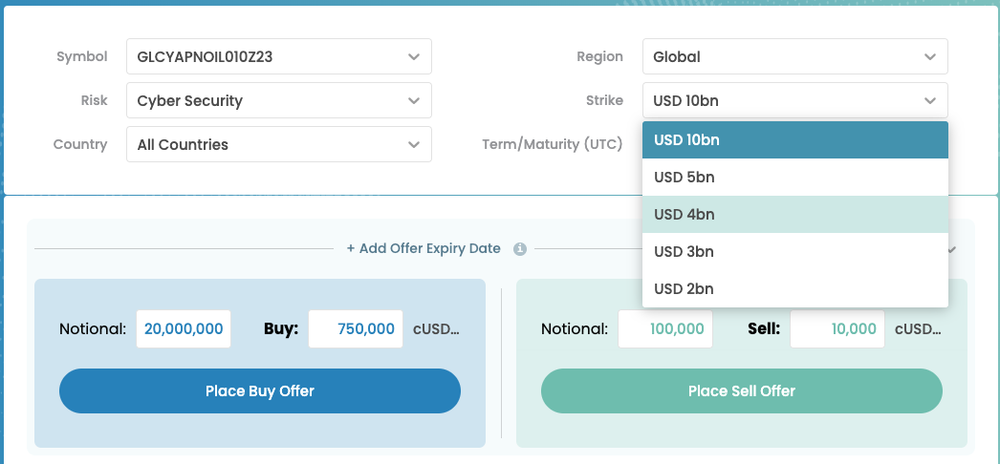

# Setting the Strike

<figure><figcaption></figcaption></figure>

Selecting the correct strike or attachment point in parametric insurance is a critical decision that requires a careful thought process. Here are some steps to guide you in making this determination:

1. **Understand the Insured Risk:**
   * Begin by thoroughly understanding the nature of the risk being insured. Consider the specific perils, events, or conditions that the parametric insurance is designed to cover. This understanding lays the foundation for determining an appropriate attachment point.
2. **Review Historical Data:**
   * Analyze historical data related to the insured risk. Examine past occurrences of the events you are trying to cover and identify the thresholds at which significant impacts occurred. This can provide insights into appropriate attachment points.
3. **Engage with Experts:**
   * Consult with experts in relevant fields, such as meteorologists, seismologists, or other specialists depending on the nature of the risk. Their expertise can help validate your understanding and guide the selection of an attachment point.
4. **Consider Sensitivity and Tolerance:**
   * Evaluate the sensitivity of the insured entity or individual to the risk. Assess the financial and operational impact of different attachment points. Balance this against the risk tolerance of both the insurer and the insured party.
5. **Modeling and Simulation:**
   * Utilize modeling and simulation tools to test different attachment point scenarios. Run simulations based on various attachment points to assess the impact on payouts and understand how different levels might align with the actual risk.
6. **Customization for Location and Specifics:**
   * Tailor attachment points to the specific characteristics of the insured location or entity. Different regions may have varying susceptibilities to certain events, and customization enhances the relevance of the attachment point.
7. **Transparency and Communication:**
   * Maintain transparency in the attachment point selection process and communicate clearly with all stakeholders. This includes both the insurer and the insured. Clear communication helps manage expectations and build trust.
8. **Legal and Regulatory Compliance:**
   * Ensure that the chosen attachment point complies with legal and regulatory requirements. Some jurisdictions may have specific guidelines or restrictions on parametric insurance attachment points.
9. **Periodic Review:**
   * Recognize that attachment points may need to be periodically reviewed and adjusted. Changes in the risk landscape, advancements in scientific understanding, or shifts in the insured entity's operations could necessitate modifications to the attachment point.
10. **Account for Deductibles or Retentions:**
    * If applicable, consider any deductibles or retentions in the parametric insurance policy. These are amounts that the insured party agrees to bear before the coverage takes effect. Ensure that the attachment point aligns appropriately with these terms.
11. **Feedback Loop:**
    * Establish a feedback loop with insured parties and other stakeholders. Periodically seek input and feedback on the attachment point to ensure ongoing alignment with the risk profile and the needs of the insured.

By following these steps and engaging in a comprehensive and collaborative decision-making process, you can increase the likelihood of selecting an attachment point that accurately reflects the insured risk and meets the needs of both the insurer and the insured party.
