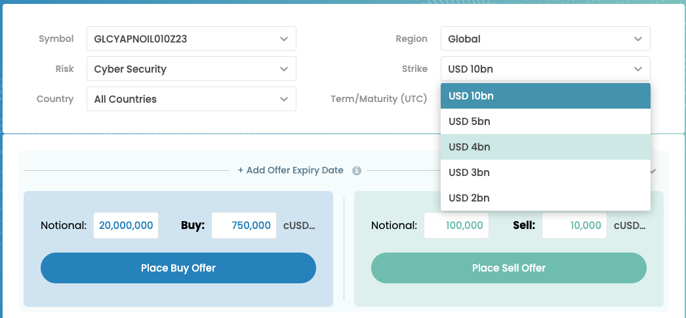

# Understanding the Parameters

You can place a deal or match an open order once all parameters are defined.

Parameters include:

* Risk
* Country
* Region
* Strike
* Term


Note that the selected currency and the blockchain are essential parameters as well. If the currency or blockchain deviates from a potential counterparty you won't see its open order or vice versa.


Once all parameters are selected, the system assigns a "symbol" which is the reference to a marketplace. You can trade with counterparties which are eager to trade with the exact same parameters.

<figure><figcaption></figcaption></figure>

An important parameter is the strike level. In below example you see industry loss in USD for a peril. The amount refers to the loss insurance companies expect caused by a peril. Stikes can have any value which can be binary determined - where a true or false condition can be met.

<figure><figcaption></figcaption></figure>

Terms are mainly set in 3-months units. This supports the mission to standartise Risk Transfer.

<figure><figcaption></figcaption></figure>

Once a Standard is selected you can place your Ask or Bid offer.

* Notional is the full amount of cover which will be held in escrow
* Premium is the amount offered to get Protection
  * the buyer pays the Premium
  * the seller pays the notional (minus the premium)&#x20;

<figure><figcaption></figcaption></figure>

